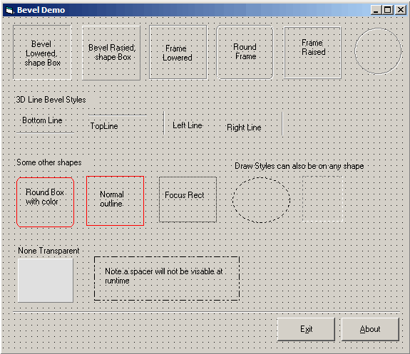



## DM BevelEx

### Description

BevelEx was ment to be a clone of the one used in delphi, this control supports 12 Shape styles, from Button bevels, Frames, Round, Frames, 3D Lines, RocusRect and much more. Control can also be made transparent and is an ideal control to spice up your programs, Please vote if you liek this code. also see screen shot.
 
### More Info
 

             |
---                |---
**Submitted On**   |2000-09-08 17:58:16
**By**             |[dreamvb](https://github.com/Planet-Source-Code/PSCIndex/blob/master/ByAuthor/dreamvb.md)
**Level**          |Intermediate
**User Rating**    |5.0 (65 globes from 13 users)
**Compatibility**  |VB 3\.0, VB 4\.0 \(16\-bit\), VB 5\.0, VB 6\.0
**Category**       |[OLE/ COM/ DCOM/ Active\-X](https://github.com/Planet-Source-Code/PSCIndex/blob/master/ByCategory/ole-com-dcom-active-x__1-29.md)
**World**          |[Visual Basic](https://github.com/Planet-Source-Code/PSCIndex/blob/master/ByWorld/visual-basic.md)
**Archive File**   |[DM\_BevelEx193090992005\.zip](https://github.com/Planet-Source-Code/dreamvb-dm-bevelex__1-62487/archive/master.zip)

